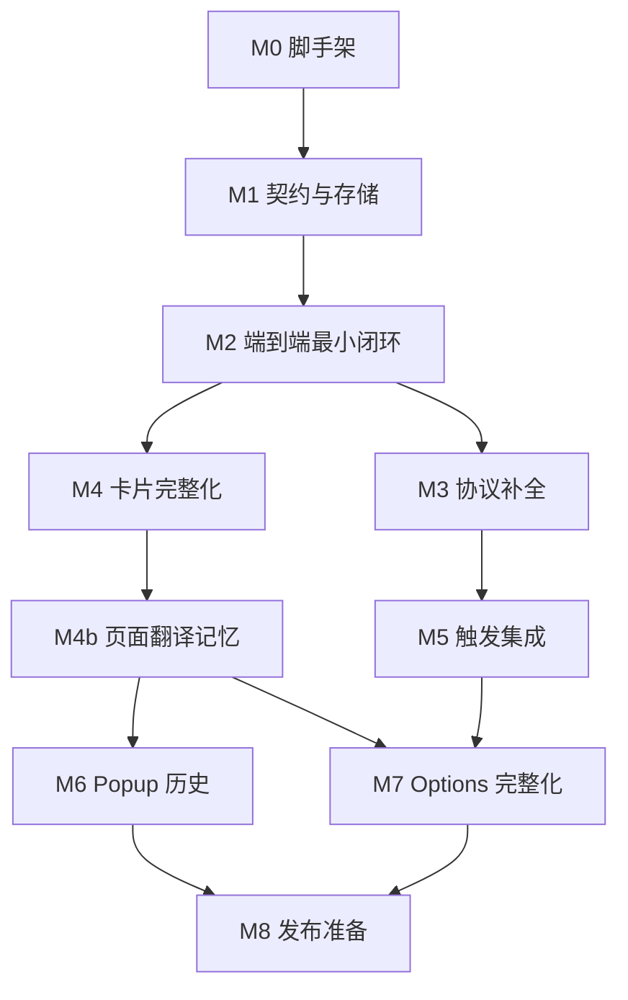

# LLM 划词翻译扩展 — 实现计划

> 依据：[DESIGN.md](./DESIGN.md)（已确认）
> 策略：**契约先行 + 垂直切片**。先打通一条端到端最小闭环，再逐块补全功能；每个里程碑结束时扩展都处于「可加载、可运行、可验证」状态，绝不长期停留在半成品。

## 里程碑总览

| 里程碑 | 内容 | 规模估算 |
|--------|------|----------|
| M0 | 项目脚手架 | 小（0.5 天） |
| M1 | 契约与存储层 | 中（1 天） |
| M2 | 端到端最小闭环 | 大（2 天） |
| M3 | 协议适配器补全 | 中（1.5 天） |
| M4 | 悬浮卡片完整化 | 大（2 天） |
| M4b | 页面翻译记忆 | 小（0.5–1 天） |
| M5 | 触发方式集成 | 小（0.5 天） |
| M6 | Popup 历史与全局开关 | 中（1 天） |
| M7 | Options 设置页完整化 | 大（1.5–2 天） |
| M8 | 发布准备 | 小（0.5 天） |

## M0 — 项目脚手架

**目标**：WXT 工程就绪，空扩展可加载进 Chrome。

- [x] 初始化 WXT + TypeScript + Preact
- [x] `wxt.config.ts` 声明：
  - `permissions: ["storage", "contextMenus"]`
  - `optional_host_permissions: ["*://*/*"]`
  - `commands`: `translate-selection`（默认 `Alt+T`）
  - content script：`matches: ["http://*/*", "https://*/*"]`，`all_frames: true`
- [x] 建立 `src/` 目录骨架（adapters / components / types / utils / storage 空模块）
- [x] TS `strict` 模式开启；配置 ESLint 基础规则
- [x] 配置 Vitest（仅纯函数单测）

**验收**：`wxt build` 零报错；Chrome「加载已解压」成功，控制台无错误。

## M1 — 契约与存储层

**目标**：所有跨模块数据结构与消息协议一次定死，后续模块只依赖契约不依赖彼此。

- [x] 核心类型（`src/types/`）：
  - `Profile`（name / baseUrl / apiKey / protocol / models[]）
  - `ModelConfig`（name / params / enabled）
  - `TranslateRequest`（选中文本 / 上下文 / 系统提示词 / 目标语言 / 模型引用 / 参数 / `memory?: Array<{ source, translation }>` 页面翻译记忆）
  - `StreamMessage`：Port 双向消息的判别联合
  - `HistoryEntry`（原文 / 译文 / 模型 / 时间 / 缓存键）
  - `AppSettings`（触发开关 / 目标语言 / 系统提示词 / 上下文范围 / 流式开关）
- [x] **Port 消息契约**（一请求一 Port，请求内串行）：
  - CS → SW：`{ type: "translate", request }`
  - SW → CS：`{ type: "meta", cached, detectedLang }` → `{ type: "chunk", text }*` → `{ type: "done" }` 或 `{ type: "error", message, canRetry }`
  - 保活：`{ type: "ping" }`（CS 忽略）
- [x] 存储封装（`src/storage/`）：settings / profiles / history（LRU 上限 500）
- [x] 工具函数（`src/utils/`）：缓存键（SHA-256：文本+模型+目标语言+上下文哈希+Prompt哈希+参数哈希+翻译记忆哈希）、URL→MatchPattern 提取
- [x] 单元测试：LRU 淘汰、缓存键稳定性、MatchPattern 提取（含端口、子路径、非法 URL）

**验收**：Vitest 全绿；类型被后续模块直接引用而无需回头修改。

## M2 — 端到端最小闭环（Walking Skeleton）

**目标**：从「划词」到「流式译文」的最短路径全线贯通，用最少的 UI 验证最核心的架构假设。

- [x] Options 最简表单：单配置档（name / baseUrl / apiKey / model），存入 storage
- [x] `openai-messages` 适配器（首发唯一协议）：
  - fetch + `ReadableStream` SSE 解析
  - 非流式端点降级：整段 chunk + done
  - `AbortSignal` 贯穿
- [x] Background：`onConnect` → 查配置 → 查缓存（命中：meta(cached) + 单 chunk + done）→ 调适配器推流；`onDisconnect` → abort
- [x] Content Script 最简版：
  - mouseup / selectionchange 检测选区（防抖）
  - 选区旁弹小按钮，点击发起翻译
  - 卡片裸版：纯文本流式渲染
- [x] 历史写入：done 时落库（供缓存与后续 Popup 复用）

**验收**：真实 API Key 下，任意网页划词 → 点按钮 → 译文流式出现；中途关卡片后 SW 日志确认请求已 abort；同一句再翻命中缓存秒显。

## M3 — 协议适配器补全

**目标**：三协议齐备，错误处理统一。

- [x] `openai-responses` 适配器（事件流：`response.output_text.delta` 等）
- [x] `anthropic` 适配器（`x-api-key` + `anthropic-version` 头，SSE `content_block_delta`，`max_tokens` 必填）
- [x] 统一错误映射：401/403（key 无效，不可重试）、429（限流，可重试）、5xx/网络（可重试）→ `error` 消息
- [x] 心跳：非流式等待期间每 20s `ping`
- [x] Options 增加「测试连接」按钮：固定例句一键验证端点连通（每协议各测一次）
- [x] SSE 解析器单测：三种协议各准备真实格式的 fixture 数据

**验收**：三个适配器真实端点各自跑通；错 key / 断网 / 超时场景错误态正确；`ping` 在慢端点上可见且不影响结果。

## M4 — 悬浮卡片完整化

**目标**：设计文档第四节全部落地。

- [x] 正式挂载：WXT `createShadowRootUi` + Preact，样式完全封装，`z-index: 2147483647`，内部事件不冒泡
- [x] 操作完整：复制 / 重试（断开旧 Port 再开新请求，绕缓存）/ 切换模型（所有启用模型扁平下拉，显示「配置档 / 模型」）/ 钉住 / 关闭（外点 / Esc / 按钮）
- [x] 竞态纪律：**一请求一 Port**；重试或切模型前必须先 disconnect 旧 Port，杜绝双流写入同一卡片
- [x] 拖动；视口 Flip/Shift 翻转避让（含 iframe 内小视口约束）
- [x] 深浅色：`prefers-color-scheme`
- [x] 缓存命中标识（meta.cached）；源语言显示
- [x] 源语言识别方案（实现期决策）：**`chrome.i18n.detectLanguage` 本地检测**，零成本不占 LLM 流式输出，结果放 `meta.detectedLang`
- [x] 复制降级：`navigator.clipboard` 失败时回退 `execCommand`

**验收**：全部操作手动清单过一遍；iframe 嵌套页（如在线文档站）定位正确；深色站点卡片可读；重试必出新结果（网络面板确认新请求）。

## M4b — 页面翻译记忆

**目标**：同页多次翻译复用滚动「原文→译文」上下文，提升术语与人称一致性。

- [x] Content Script 按 frame 维护页面记忆（纯内存，随页面生命周期，刷新即重置）
- [x] done 后追加记忆；同一选区重试成功覆盖末条；重试/切模型不清空记忆
- [x] 三个适配器将记忆渲染为各自协议的历史轮次（messages 数组 / responses input / anthropic messages）
- [x] 有界控制：窗口 3 条、单条 300 字符、总预算 4000 字符 FIFO 淘汰
- [x] 缓存键并入记忆哈希；单测覆盖（空记忆时键与基础路径一致）
- [x] 设置项：开关（默认开启）、窗口大小（1–10）
- [x] 源语言检测不受影响（仍走 `chrome.i18n.detectLanguage`）

**验收**：同页先翻含术语/人名的句子，再翻含代词或同术语的句子，译法一致；刷新页面后记忆重置；网络面板确认请求体增长有上界；关闭开关后请求体回到无记忆形态。

## M5 — 触发方式集成

**目标**：三种触发方式并存且各自受设置开关控制。

- [x] 右键菜单：`contextMenus.create`（`contexts: ["selection"]`），`onClicked` → `tabs.sendMessage(tab.id, …, { frameId: info.frameId })` 精确路由
- [x] 快捷键：`commands.onCommand` → 广播该标签页所有 frame（不带 frameId），无选区 frame 静默忽略
- [x] 设置开关联动：划词按钮 / 右键 / 快捷键三开关，SW 启动时按设置注册菜单与命令处理
- [x] 全局开关：禁用后三种触发全部静默
- [x] 设置页：快捷键修改引导按钮 → `chrome://extensions/shortcuts`

**验收**：三方式各自触发成功；逐个关闭开关后对应方式失效；全局开关一剑封喉。

## M6 — Popup 历史与全局开关

**目标**：工具栏 popup 成为历史与总控。

- [x] 历史列表（时间倒序）：原文 + 译文 + 模型 + 时间；首屏 20 条，滚动加载
- [x] 搜索（原文/译文模糊匹配）；单条复制；一键清空（确认弹窗）
- [x] 全局开关（与 M5 联动）；设置入口

**验收**：翻译记录实时入列；搜索、复制、清空、分页可用；开关状态与设置页一致。

## M7 — Options 设置页完整化

**目标**：配置能力对齐设计文档第六节。

- [x] 配置档管理：增删改、排序；每档内模型列表增删改、启用开关、参数编辑（temperature / max_tokens 等）
- [x] 默认模型全局唯一标记；卡片模型下拉与配置档数据联动
- [x] **权限申请流程**：保存配置档时在点击事件处理器内**同步调用** `chrome.permissions.request({ origins: [matchPattern] })`；baseUrl → MatchPattern 自动提取；拒绝授权时明确提示并阻止保存
- [x] 翻译设置：目标语言（预置常用列表）、系统提示词多行编辑、上下文范围（0–N，默认 0）、流式开关
- [x] 触发设置：三开关 + 快捷键引导（M5 已建，此处收口）
- [x] 历史设置：清空按钮

**验收**：保存新配置档出现浏览器授权弹窗；拒绝/允许两条路径都正确；未授权端点调用时错误信息引导回设置页。

## M8 — 发布准备

**目标**：可提交 Web Store 的完整产物。

- [x] 图标三规格：`icons/icon-16.png` / `icon-48.png` / `icon-128.png`（独立绘制，非单图缩放）
- [x] `CHROMEWEBSTORE.md`：名称、一句话与详细描述、权限理由（storage / contextMenus / optional_host_permissions）、隐私声明（零后端、零收集、BYOK 直连）
- [x] 全量冒烟清单（`test/SMOKE.md`）：普通页 / iframe 重站点 / 深色站点 / 慢端点流式 / 断网重试 / 三触发方式 / 缓存命中 / 历史上限淘汰 / 卸载重装
- [x] `wxt zip` 产出商店包

## 验证策略

1. **单元测试（Vitest，仅纯函数）**：SSE 解析器（三协议 fixture）、缓存键、LRU、MatchPattern 提取、URL 规范化。
2. **真实端点验证**：Options「测试连接」按钮，一键发送固定例句，按协议分别验证。
3. **手动冒烟**：`test/SMOKE.md` 随里程碑增量维护，M8 全量执行。

## 实现期已锁定的技术细节（补充设计文档）

| 决策 | 结论 |
|------|------|
| 源语言识别 | `chrome.i18n.detectLanguage` 本地检测，走 `meta.detectedLang`，不占 LLM 输出 |
| Port 生命周期 | 一请求一 Port；重试/切模型先 disconnect 旧 Port 再发起新请求 |
| SW → CS 首消息 | `meta`（cached + detectedLang）先于一切 chunk，卡片据此渲染徽标 |
| 缓存命中流程 | meta(cached) + 单 chunk(全量) + done，与流式降级共用同一渲染路径 |
| 快捷键修改 | 保留跳转 `chrome://extensions/shortcuts` 方案（简单可靠，兼容旧版 Chrome） |
| 页面记忆归属 | Content Script 内存态（= 页面生命周期），SW 不持有；按 frame 隔离 |
| 记忆渲染方式 | 客户端重发滚动历史（user=原文摘录 / assistant=译文），不用服务端会话机制 |

## 风险清单与验证点

| 风险 | 缓解 | 验证点 |
|------|------|--------|
| MV3 SW 被回收掐断长请求 | 心跳 ping（20s） | 构造 >30s 慢端点，流不中断 |
| 多 frame 广播时多卡片竞开 | 实际仅焦点 frame 持有选区；无选区 frame 静默 | iframe 页实测快捷键 |
| 重试与旧流竞态 | 一请求一 Port，disconnect 即 abort | 快速连点重试，网络面板仅一条在途请求 |
| 复制权限被拒 | execCommand 降级 | file:// 与受限页面测试复制 |
| 选区位于 Shadow DOM 内 | 现代 Chrome `getSelection` 跨 shadow 可用 | 含 Web Components 的站点实测 |
| optional 权限被拒 | 保存即失败并引导重试 | 拒绝授权路径走一遍 |

## 工程规范

- TypeScript `strict`；公共类型改动需同步更新使用方，不留 `any` 过渡
- 提交粒度跟里程碑走，每个 checkbox 完成即提交，信息格式 `M2: 实现选区按钮防抖`
- 每个里程碑完成在本文件勾选对应项，作为进度单一事实来源
